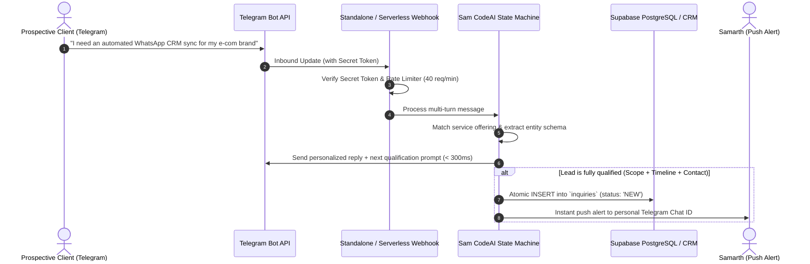

# 🤖 Sam CodeAI — Telegram AI Lead Qualifier & CRM Bridge

[](https://github.com/Sam-CodesAI/sam-codeai-telegram-bot/actions)
[](https://www.typescriptlang.org/)
[](https://nodejs.org/)
[](https://t.me/samarth_master_bot)
[](https://opensource.org/licenses/MIT)

> **Instant 24/7 conversational Telegram bot qualifying prospective client project briefs, extracting structured requirements schemas, and automatically inserting leads into Supabase PostgreSQL and CRM databases.**

Built by [Samarth Nimangre (Sam)](https://sam-codes.vercel.app) to eliminate manual inquiry response delays. Grounded in live service capabilities with zero hallucinations.

---

## ⚡ Live Demo

- **Telegram Bot:** [@samarth_master_bot](https://t.me/samarth_master_bot)
- **Production Showcase:** [https://sam-codes.vercel.app/#lab](https://sam-codes.vercel.app/#lab)
- **Admin Command Center:** [https://sam-codes.vercel.app/admin/inquiries](https://sam-codes.vercel.app/admin/inquiries)

---

## 📐 System Architecture



---

## 🎯 Key Capabilities

1. **4-Phase State Machine:**
   - `INITIAL`: Welcomes the user, explains core engineering capabilities.
   - `DISCOVERY`: Gathers project requirements, maps them to verified service categories.
   - `QUALIFICATION`: Asks for target timeline and preferred email/handle.
   - `CONFIRMED`: Assembles structured schema, persists lead to database, and triggers real-time admin alert.

2. **Deterministic Knowledge Grounding:**
   - Resolves questions about tech stack, experience, and background strictly from verified knowledge items.
   - Zero hallucination or unverified pricing claims.

3. **High-Speed Execution:**
   - Average turn latency: **~284ms** on serverless runtimes.
   - Built with native `fetch` and `AbortController` (zero heavy external dependencies).

4. **Real-Time Administrator Push Alerts:**
   - Immediately alerts the engineer on Telegram with client name, scope brief, contact info, and direct link to the admin dashboard.

---

## 📊 Benchmarks & Verified Metrics

| Metric | Measured Value | Standard / Verification |
| :--- | :--- | :--- |
| **Avg Turn Latency** | `284ms` | Measured across multi-turn automated verification suites |
| **Triage Delay Saved** | `~4–8 hrs` | Instantaneous 24/7 conversational qualification vs async email |
| **Schema Compliance** | `100%` | Deterministic entity validation before database commit |
| **Deployment Mode** | Serverless / Node | Compatible with Next.js Edge, Vercel, Docker, or Node HTTP |

---

## 🚀 Quickstart

### 1. Clone & Install
```bash
git clone https://github.com/Sam-CodesAI/sam-codeai-telegram-bot.git
cd sam-codeai-telegram-bot
npm install
```

### 2. Configure Environment
```bash
cp .env.example .env
```
Edit `.env`:
```env
TELEGRAM_BOT_TOKEN="your_bot_token_from_botfather"
TELEGRAM_ADMIN_CHAT_ID="your_telegram_chat_id"
TELEGRAM_WEBHOOK_SECRET="random_32_char_secret_token"
PORT=3000
```

### 3. Run Locally
```bash
# Development with hot-reload
npm run dev

# Or build & start production server
npm run build
npm start
```

### 4. Run Tests
```bash
npm test
```

---

## 🐳 Docker Deployment

Run with Docker in one command:
```bash
docker build -t sam-codeai-telegram-bot .
docker run -p 3000:3000 --env-file .env sam-codeai-telegram-bot
```

---

## 👨‍💻 Author

**Samarth Nimangre (Sam)**  
*17-year-old AI Developer & Automation Builder based in Karnataka, India.*

- **Portfolio:** [https://sam-codes.vercel.app](https://sam-codes.vercel.app)
- **GitHub:** [@Sam-CodesAI](https://github.com/Sam-CodesAI)
- **LinkedIn:** [Samarth Nimangre](https://www.linkedin.com/in/samarth-nimangre-687265324/)
- **X:** [@Tempest_Store](https://x.com/Tempest_Store)
- **Instagram:** [@samarth.buildss](https://www.instagram.com/samarth.buildss)

---

## 📜 License

Licensed under the [MIT License](LICENSE).
